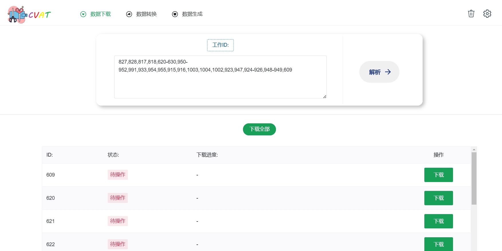
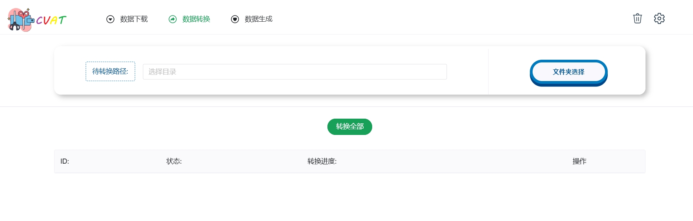
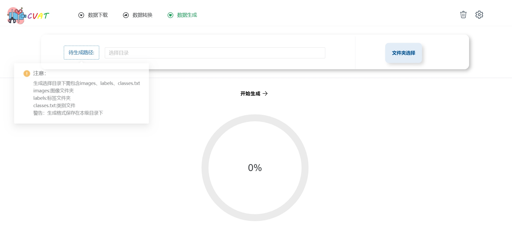

# cvat_deal 工具前端

### 项目介绍

基于CVAT项目做的一个后处理工具，功能包含批量下载job，批量将cvat1标签转为yolo格式（分割标签和目标检测标签），以及将yolo格式转为cvat1格式。

#### 1 批量下载job



#### 2 数据转换



#### 3 数据生成



### 项目安装

```
npm install
```

### 项目运行
```
npm run serve
```

### 项目打包
```
npm run build
```

